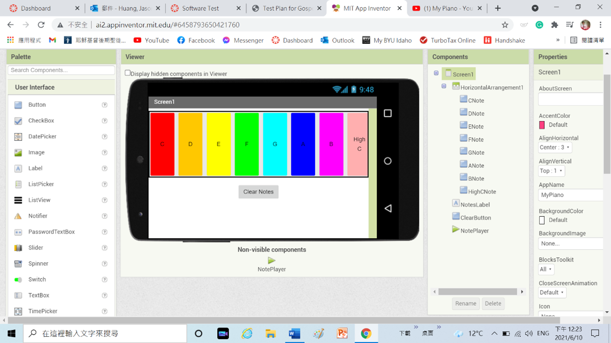

# Sprint_4_MoblieApp

# Overview

Basic Purpose of App: My Piano is an application that can run on IOS, Android, and Microsoft Windows. You can play with “My Piano” at any devices, like computer or tablet and smartphone. Try to play all the keys, and you can hear all the notes with “C” “D” “E” “F” “G” “A” “B” “High C”.

[Software Demo Video](https://www.loom.com/share/7fbebf8a6cd449e5a455b49bcfb4b1bb)

# Development Environment
Six Simple Test Steps:
Test 1 Basic Navigation
1.	When you invoke the App you should see the following screen:

2.	With your procedure now all eight notes play a sound. 

3.	You’ll also see that the text at the bottom changes corresponding to which note you’ve just pressed. 

4.	Click the Clear Notes bottom, and it is able to clear the notes at the touch of the bottom.

5.	You’ve completed the App! 

6.	You can also create your own sounds with this app, make your own music!

# Useful Websites

* [MIT App Inventor](https://appinventor.mit.edu/)

# Future Work

* Save the songs in the database.
* Microphone recording music
